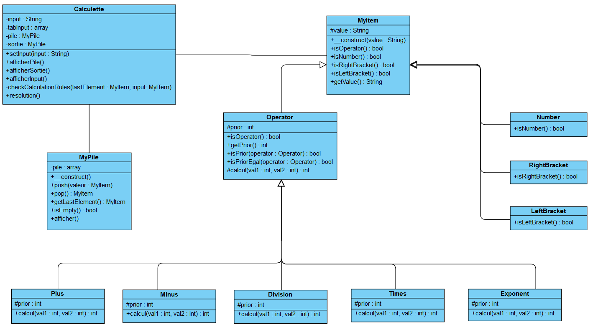

# Reverse Polish notation
<h3>A simple PHP project</h3>

For more information :

<a href="https://fr.wikipedia.org/wiki/Notation_polonaise_inverse" target="_blank"> RPN on Wikipedia</a>

<h4>Purpose </h4>
Write for an interview, share for the students.

<h4>class diagram</h4>

